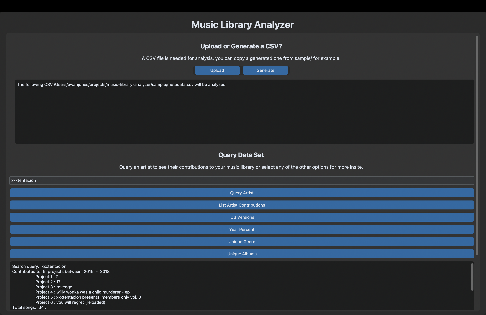

# Music Library analyzer


## requirements
- Rscript
- Python3
- python-tk
- Cmake
- Gcc, Clang, MSCV, or Mingw

## usage
```bash
pip -r requirements.txt
python3 app.py
```

there is a sample csv for testing located in 'sample/'